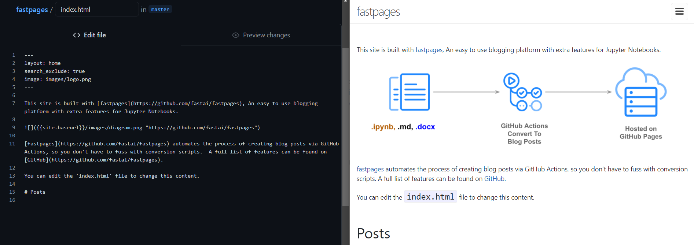
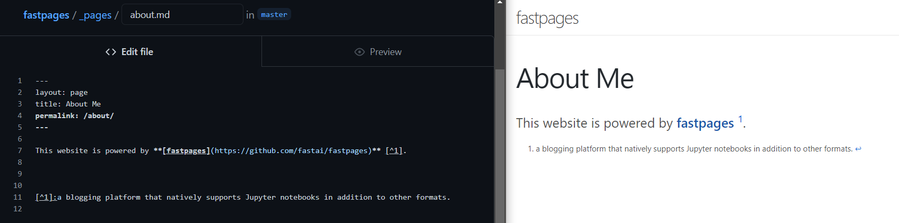

---
# Setting Up This Blog Using `fastpages`
---
## Background



Over the course of this year when I got deeper into Machine Learning and Computer Vision, I started to come across posts and comments advising folks new to programming in general to create a blog detailing their journey. The benefits of creating such a blog could be summed up as:

- You are presently in the best position to help along another newcomer who is a few steps behind you. This is because the issues you came across and the mistakes you made are still fresh in your mind and the resources you consulted to overcome/correct those issues/mistakes are still fresh in you mind and close to hand.
- It is generally agreed that writing about a topic helps deepen your understanding of the topic and force you to address the gaps in your knowledge.
- You write for totally selfish reasons. You write for posterity. You write for your future self.

Given the schools of thought I was exposed to while learning programming and my personal way of doing things, my code is always littered with detailed and sometimes superfluous comments. Thus, initially it seemed all I needed to do was put all my comments for a project together, edit and format into a coherent document and voila! blog post.

Unfortunately, the various resources I found online for creating simple blogs were overly involved and required knowledge of html and other web-related stuff of which I knew nothing. Furthermore, I wasn't interested in going on a tangent when my focus id `Machine Learning` and `Computer Vision`. I come across [GitHub Pages](https://pages.github.com/) at this point but it was more of the same.

> **So, I gave up on creating a blog and stuck to writing detailed comments in my code.**

Then I took [fast.ai's](https://www.fast.ai/) [Practical Deep Learning for Coders](https://course.fast.ai/) online course. At some point in Lesson 3, when [Jeremy Howard](https://twitter.com/jeremyphoward) started going on about writing and blogs, I went all "Here we go again." Then he introduced {fastpages](https://github.com/fastai/fastpages) and it was all I ever needed.

<iframe width="560" height="315" src="https://www.youtube.com/embed/5L3Ao5KuCC4?start=3441" title="YouTube video player" frameborder="0" allow="accelerometer; autoplay; clipboard-write; encrypted-media; gyroscope; picture-in-picture" allowfullscreen></iframe>

> **Create a blog using jupyter notenooks and markdown files? Take my money!!!**


---
## Introducing `fastpages`

> `fastpages` is an easy to use blogging platform, with support for Jupyter notebooks, Word docs, and Markdown.


`fastpages` uses [GitHub Actions](https://github.com/features/actions) to simplify the process of creating [Jekyll blog posts](https://jekyllrb.com/) on [GitHub Pages](https://pages.github.com/) from a variety of input formats.


See the [fastpages](https://github.com/fastai/fastpages) GitHub repository for a more detailed list of features.



---
## Initial Setup
The initial setup is totally straightforeward and effortless. The [setup instructions](https://github.com/fastai/fastpages#setup-instructions) are detailed and there is even a [walkthrough on YouTube](https://youtu.be/L0boq3zqazI) if that wasn't enough.

> It wasn't enough for me. There was part of the setup where I needed to merge a pull request but I somehow didn't see that line in the instructions.

<iframe width="560" height="315" src="https://www.youtube.com/embed/L0boq3zqazI" title="YouTube video player" frameborder="0" allow="accelerometer; autoplay; clipboard-write; encrypted-media; gyroscope; picture-in-picture" allowfullscreen></iframe>

With the setup instructions and YouTube walkthrough, you can't go wrong. If you, go through either of them again, slowly. You most definitely missed something.

## Customizing Your Blog
Once you're done with the intial setup, you'll get a generic blog that contains a few placeholders from `fastbook`. There are a few simple changes you can make to put your personal stamp on your blog. 

These changes can be implemented across three files in you new blog repository. I will list the files and the personalizations that can be done in each.

#### `index.html`
This file is responsible for the the content of the blog's homepage -- between the `top bar` and the `Posts` section. The picture below shows the code and the result in the homepage.



Two sets of changes can be made in this file:
1. *Line 4*: The blog logo by sepecified by a file placed in the `images` folder of the base directory. This is the image preview automatically shown with your blog URL on social media sites. You can either:
    - replace the fastpages logo with one of your own choosing, leaving `Line 4` as it is; or
    - add you own file to the `images` folder and edit the filename in `Line 4`.

    

1. *Lines 6-14*: Everything here can be removed and replaced with content of your choosing. From my experience, the content can be in html format or markdown format or a mix of both formats.


#### `README.md`
Theis file is responsible for the content of the blog's github repository page -- after the folders and files have been listed.


Two sets of changes can be made to this file:
1. *Line 6*: You can totally remove that line, thus removing the `View Demo Site` badge. On the other hand, you might want to change it to one of your choosing and make it point to another link. 

    This is quite simple. The [shields.io](https://shields.io/) developer site contains example code on how to create your own custom badges. 

    If you want to use a shield logo other than the ones available, you need to convert your png to base64 code. You can't just specify a path to the .png file. [b64.io](https://b64.io/) is a free resource for converting images to base64 format. The logo is then specified in the badge code using the snippet below.
    
    ```markdown
    ?logo=data:image/png;base64,…
    ```
    You can consult the answers provided to this [stackoverflow question](https://stackoverflow.com/questions/38985050/how-do-i-use-the-logo-option-in-shields-io-badges) if you have any difficulty creating you custom badge. You can create any number of badge this way, all with different attributes.
    
1. *Lines 7-554*: Everything here can be removed and replaced with content of your choosing. The content has to be in markdown format.

#### `\_config.yml`
This is the main configuration file for the blog. This file should be edited carefully as any mistakes will cause errors when GutHub tries to build your blog. The main fastpages [README.md](https://github.com/fastai/fastpages#customizing-blog-posts-with-front-matter) provides detailed information on what parts of the blog the parameters in this file control.

However, since we're talking about simple customizations, here are some:
1. *Line 9*: This controls the title of the blog found at the top of the homepage. It is freely customizable.
1. *Line 10*: This controls the blog description at the very bottom of the homepage. It is freely customizable.
1. *Lines 39-43*: Here you can add links you your social media accounts and other professional accounts. This [link](https://github.com/jekyll/minima#social-networks) provides the list if supported social networks and their keys.
1. *Line 52*: This controls the display image previews on home page, for posts that have them. It is set to `false` by default. You should try it out, it's a good look.

#### `images`
This folder contains images necessary for customizing the look of the blog's URL. There are a couple of changes you can make here.
- `logo.png`: As stated earlier, this specfies the image preview can be automatically shown with your URL on social media sites. This is freely ccustomizable.
- `favicon.ico`: This controls the page icon shown on the browser tab when the site is opened in browser. There are lots of free resources for [downloading .ico file](https://icon-icons.com/) or [converting your .png to .ico](https://convertico.com/).

  

#### `pages/about.md`
This file is responsible for the the content of the blog's `About Me` page -- found on right-side of the `top bar`. The picture below shows the code and the result on the blog.



Everything from *Lines 7-12* can be removed and replaced with content of your choosing. The content has to be in markdown format.

That's about it for simple ccustomizations' you can make your blog at first go.

---
## Further Customizations
Here are some other advanced customizations you can carry out. They are advanced in the sense that you need to go through the documentation of the various resources used by fastpages in order to figure out to to modify them. 

At this point, you'll be diverging greatly from the default `fastpages` setup for your blog, thus you'll need to modify/add multiple files to successfully make a modification.

---
## Further Links
Here are some useful links the I coudn't add in the main post:
- 
- 
- 
- 

---

---

---